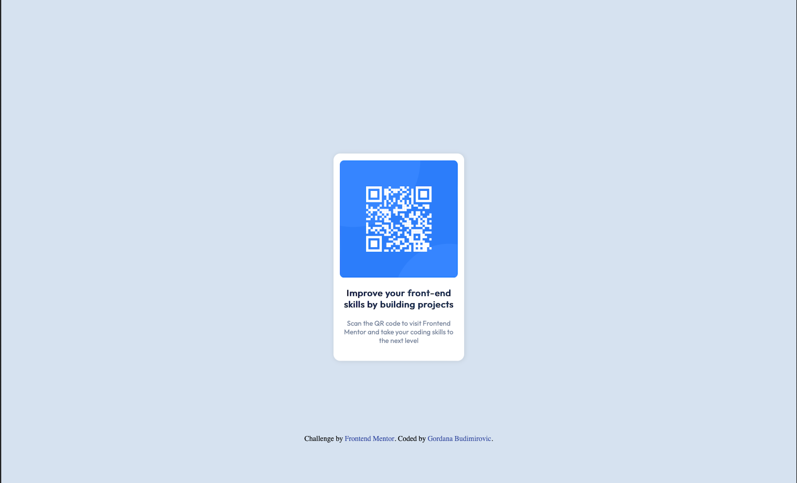

# Frontend Mentor - QR code component solution

This is a solution to the [QR code component challenge on Frontend Mentor](https://www.frontendmentor.io/challenges/qr-code-component-iux_sIO_H).

### Screenshot

### Links

- Solution URL: [Add solution URL here](https://github.com/gogana96/qr-code-challenge)
- Live Site URL: [Add live site URL here](https://gogana96.github.io/qr-code-challenge/)

## My process

### Built with

- Semantic HTML5 markup
- CSS custom properties
- Flexbox

## Author

- Frontend Mentor - [@Gogana96](https://www.frontendmentor.io/profile/gogana96)

